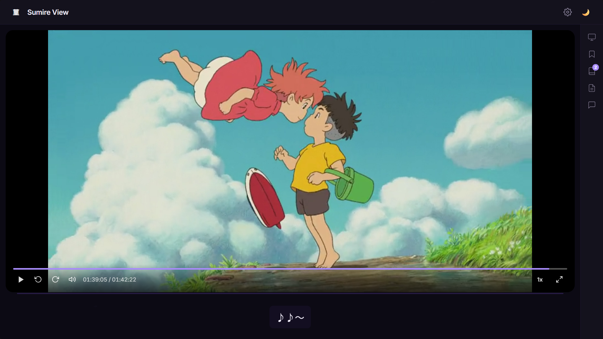
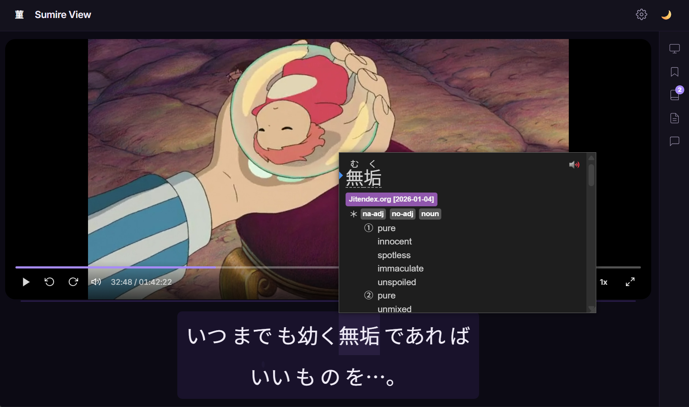
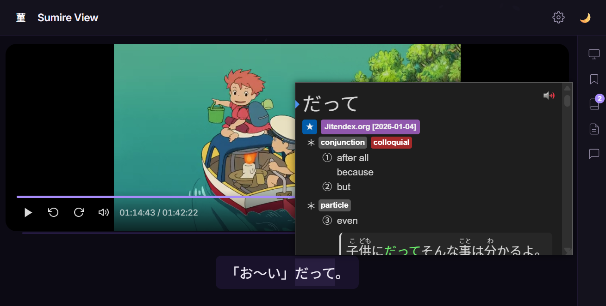

<div align="center">

# 菫 Sumire View

**A Premium Anime Learning Player with Japanese Aesthetics**

*Immerse yourself in anime while mastering Japanese — powered by in-browser live transcription, Jimaku subtitle search, Yomitan integration, and a design that feels like home.*

[](https://SlahtalabMohsen.github.io/react-sumire-view/)
[](#)

</div>

---

<div align="center">





</div>

---

## What is Sumire View?

Sumire View is a lightweight, responsive video player designed specifically for anime learners. It combines a clean, Apple-inspired Japanese aesthetic with powerful language-learning tools — letting you watch, read, and study without ever leaving the player.

Drop in a video file, load your subtitles, and start learning. No subtitles on hand? Generate them live from the audio with in-browser Whisper, or search and download official Japanese subtitles from Jimaku. With Yomitan popup dictionary support, you can hover over any Japanese word to get instant definitions, pitch accents, and example sentences.

---

## Key Features

### 🎙️ Live Japanese Subtitles (Whisper · ブラウザ内 音声認識)
Generate Japanese subtitles in real time from any video's audio — **entirely in your browser**:
- Runs [Transformers.js](https://huggingface.co/docs/transformers.js) + Whisper ONNX in a **Web Worker**, so playback and the UI stay smooth.
- Prefers **WebGPU**, with a **WASM fallback** (an indicator in the panel shows which backend is active).
- The model downloads once and is **cached locally** for offline use afterwards. Nothing is uploaded anywhere.
- Transcription is always `ja` / `transcribe` — never translated.
- Handles pause, resume, and seeking correctly; segments are timestamped against the video timeline.
- Export the results as a proper **.srt** file or plain text at any time.

### 🔎 Jimaku Subtitle Search (字幕検索)
Find and load official Japanese subtitles without leaving the player:
- Detects the anime title, season, and episode from the file name (`S01E03`, `E03`, `#03`, `第3話`, `- 03`, …). The guess is always editable before searching.
- Searches the [Jimaku](https://jimaku.cc/) API directly from the browser, lists matching anime, and shows every available Japanese SRT/ASS file.
- **Load** a file straight into Sumire View, or **download** it to your device.
- Your API key is stored only in this browser and sent directly to `jimaku.cc` — it is never bundled with the app.

### 📚 Multiple Subtitle Sources, Kept Separate
Live Whisper output, Jimaku downloads, and locally imported files each live on their **own track**. Sources never overwrite one another, and every track can be toggled independently.

### 🌸 Apple × Japanese Design
Minimalist glassmorphism UI with violet accents, smooth animations, and three theme modes (Light, Dark, Sepia). Seasonal accent colors — cherry blossoms in spring, fireworks in summer, maple leaves in autumn, snow in winter.

### 📚 Yomitan Integration
Hover over any Japanese word in the subtitles to see definitions instantly. Sumire View is fully compatible with the [Yomitan Popup Dictionary](https://chrome.google.com/webstore/detail/yomitan/) extension for Chrome and Firefox.

### 📝 Interactive Subtitle Log
A JRPG-style dialogue log that syncs with playback in real-time. Search through dialogue, click any line to seek to that moment, and never lose track of what's being said.

### 🔍 Furigana Support
Toggle furigana reading aids above kanji characters with a single click in Settings. Perfect for intermediate learners bridging the gap between hiragana and full kanji literacy.

### 🎬 Video Player
Full-featured player with drag-and-drop video loading, playback speed control (0.5x–2x), progress scrubbing with hover preview, volume control, and native fullscreen support.

### 📖 Subtitle Import
Import SRT, VTT, and ASS subtitle files with multi-track support. Load multiple subtitle tracks and toggle them independently — imported files, Jimaku downloads, and live Whisper output coexist as separate tracks.

### 📑 Vocabulary Builder
Click on any subtitle text to instantly save words with their full context and timestamps. Review your saved vocabulary in the sidebar and jump back to the exact moment a word was spoken.

### 📌 Bookmarks & Notes
Save timestamps with custom notes while watching. Export all your bookmarks and vocabulary to a text file for offline study.

### 🎛 Dynamic Layout
Manually resize the video and subtitle areas by dragging the divider. Your preferred split ratio is saved and restored across sessions.

### ⌨️ Keyboard Shortcuts
Full keyboard navigation for a seamless experience — Space to play, arrow keys to seek and adjust volume, M to mute, F for fullscreen.

---

## Prerequisites

### Yomitan Extension (Recommended)

To use the word-lookup features, install the **Yomitan Popup Dictionary** extension:

- **Chrome:** [Install from Chrome Web Store](https://chrome.google.com/webstore/detail/yomitan/)
- **Firefox:** [Install from Firefox Add-ons](https://addons.mozilla.org/en-US/firefox/addon/yomitan/)

**How to use it:**
1. Install Yomitan from the extension store above
2. Open Sumire View and load a video with Japanese subtitles
3. Hover over any Japanese word in the subtitle area
4. Yomitan will show you the meaning, reading, pitch accent, and example sentences

### Jimaku API Key (optional, for subtitle search)

To search and download Japanese subtitles from [Jimaku](https://jimaku.cc/):

1. Create a free account at **[jimaku.cc](https://jimaku.cc/)**
2. Open your **[account page](https://jimaku.cc/account)** and generate an API key
3. In Sumire View, open the **Subtitles** tab, paste the key into the *Jimaku API key* field, and press **Save**

The key is stored only in your browser's local storage and is sent directly to `jimaku.cc`. It is not included in the app's source or shipped anywhere else. Live transcription needs **no key at all** — it runs fully locally.

> **Note:** Live Whisper transcription works best in a browser with WebGPU support (recent Chrome, Edge, or Firefox). Without it, inference falls back to WebAssembly, which is slower but still functional.

---

## Installation & Local Development

```bash
# Clone the repository
git clone https://github.com/SlahtalabMohsen/react-sumire-view.git

# Navigate to the project
cd react-sumire-view

# Install dependencies
npm install

# Start the development server
npm run dev

# Build for production
npm run build

# Preview the production build
npm run preview
```

---

## Deployment

The live version is hosted on **GitHub Pages** at:

> **https://SlahtalabMohsen.github.io/react-sumire-view/**

To deploy your own instance:

```bash
npm run deploy
```

This builds the project and pushes the `dist/` folder to the `gh-pages` branch.

---

## Tech Stack

| Technology | Purpose |
|------------|---------|
| React 19 | UI framework |
| TypeScript | Type safety |
| Vite 8 | Build tool & dev server |
| Tailwind CSS 4 | Utility-first styling |
| Framer Motion | Animations & transitions |
| Transformers.js | In-browser Whisper transcription (ONNX, WebGPU/WASM) |

> No backend or server is required — transcription, subtitle parsing, and Jimaku
> search all run client-side. The app deploys to GitHub Pages as static files.

---

## Keyboard Shortcuts

| Key | Action |
|-----|--------|
| `Space` / `K` | Play / Pause |
| `←` | Skip 5 seconds backward |
| `→` | Skip 5 seconds forward |
| `↑` | Volume up |
| `↓` | Volume down |
| `M` | Toggle mute |
| `F` | Toggle fullscreen |

---

## Project Structure

```
src/
├── components/
│   ├── VideoPlayer/            # Main video player with controls
│   ├── LiveJapaneseSubtitles/  # Whisper status, start/stop, exports
│   ├── JimakuPanel/            # API key, title detection, search, files
│   ├── SubtitlePanel/          # Active subtitle display
│   ├── SubtitleLog/            # Dialogue history with search
│   ├── SubtitleImport/         # File import (drag & drop)
│   ├── Settings/               # Theme, layout, subtitle settings
│   ├── BookmarkPanel/          # Timestamped notes
│   ├── CommentSection/         # Timestamped comments
│   ├── MinimalSidebar/         # Collapsible sidebar navigation
│   ├── VocabularyList/         # Saved vocabulary display
│   ├── Header/                 # App header with logo & controls
│   ├── CherryBlossom/          # Seasonal petal animation
│   ├── ErrorBoundary.tsx       # Graceful error recovery
│   └── Tooltip/                # Hover tooltip component
├── hooks/
│   ├── useVideoPlayer.ts       # Video element control
│   ├── useSubtitles.ts         # Subtitle track management
│   ├── useWhisper.ts           # Live transcription orchestration
│   ├── useJimaku.ts            # Jimaku search/load/download flow
│   ├── useKeyboardShortcuts.ts
│   ├── useTheme.ts             # Theme & season persistence
│   ├── useVocabulary.ts        # Vocabulary with localStorage
│   └── usePanelResize.ts       # Resizable panel splitter
├── workers/
│   └── whisper.worker.ts       # Whisper inference (off the main thread)
├── services/
│   └── jimaku.ts               # Jimaku API client + key storage
├── transcription/
│   └── audioCapture.ts         # Web Audio capture from the <video>
├── parsers/                    # SRT, VTT, ASS parsers
├── types/                      # TypeScript type definitions
├── utils/                      # Time, SRT export, filename parsing, formatting
├── App.tsx                     # Main application
├── App.css                     # Layout styles
└── index.css                   # Global styles & theme variables
```

---

## License

MIT
